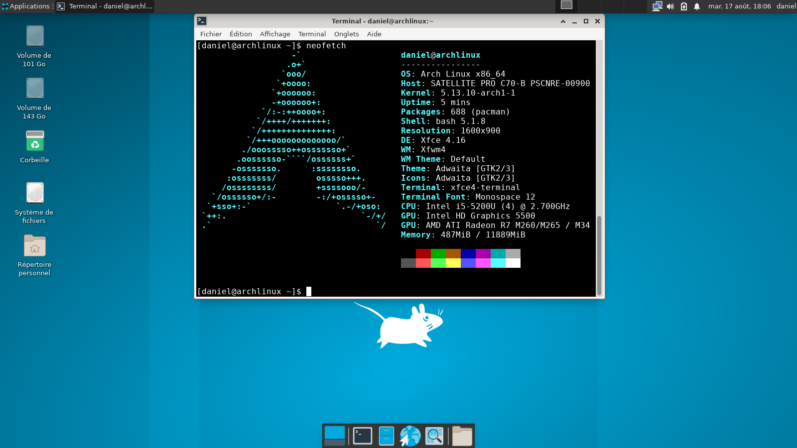
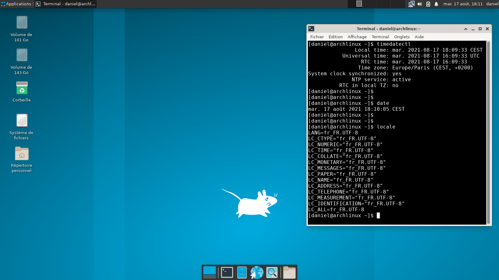

# Installation d'Arch Linux

## Installation spécifique pour les supports amovibles à mémoire flash NAND tels que clé USB,SSD,carte SD... .

| Document | Description |
|:--|:--|
| usb_arch_linux_project.md | Documentation. |
| before_install.md | Prérequis avant installation. |
| install_arch.md | Installation d'Arch Linux de base. |
| install_xfce.md | Installation et configuration d'un environnement graphique sous XFCE4. |
| install_arch_xfce.sh | Script pour automatiser l'installation et la configuration. |
| background.png | Fond pour le menu GRUB, [aurora-borealis-starry-night-night](https://publicdomainpictures.net/en/view-image.php?image=310278&picture=aurora-borealis-starry-night-night)|

### Utilisation du script "install_arch_xfce.sh"

1. Lancer l'image live d'Arch Linux sur un ordinateur.
2. Copier ce dépôt dans le live d'Arch Linux ou copier juste le script et l'image de background.
3. Exécuter le script avec les options adéquates.

```Bash
#--------------------------------------------------#
# Description: 
# Ce script permet d'automatiser l'installation d'Arch Linux 
# sur des disques à mémoire flash NAND tels que SSD, clé USB, carte SD...
#                                                   
#  Usage:
#  ./install_arch_xfce.sh -[h|v]
#  
#  ./install_arch_xfce.sh -d <Disque>:<Phrase chiffrement> -u <Nom utilisateur>:<Passe utilisateur> -n <Nom machine>
#  
#  -h : Affiche l'aide.
#  -v : Affiche la version.
#  
#  -n : Nom de la machine.
#  -u : Nom utilisateur suivie du mot de passe utilisateur.  Ex: (daniel:****)
#  -d : Nom du disque suivie sa passe phrase de chiffrement. Ex: (sda:***************)
#
#  Exemple :
#
#  * Pour Installer Arch Linux sur un périphérique physique USB :
#
#  sudo ./install_arch_xfce.sh -d sdb:*************** -u daniel:******** -n Arch
#                                         
#--------------------------------------------------#
```

#### Les caractéristiques de fonctionnement du script 

Il est obligatoire de fournir au moins le nom du disque et la phrase passe.
Si vous décider de juste remplir le nom du disque et la phrase passe alors des données par défaut seront appliquées pour les autres champs.

Les données par défaut sont :

* Nom utilisateur : userx
* Mot de passe utilisateur : usertemppass
* Nom de la machine : Arch

Si on place une image avec comme extension ".png" et renommé en "background.png" à coté du script alors le script la prendra pour l'appliquer comme fond d'écran pour le menu de GRUB, ceci n'est pas obligatoire.

* Taille recommandée pour l'image : 1920x1080

Cette installation fonctionne aussi bien sur un amorçage en UEFI qu'en BIOS legacy, peut importe la configuration de la machine.

La table des partitions est en GPT.

A la fin du script la machine s’éteint.

#### Limites des options

* Le script doit être exécuté avec les droits root.
* L'installation ne se connecte pas automatiquement sur une connexion WIFI.
* L'ordinateur doit être connecté à internet par câble,(si non configuration manuelle du WIFI).
* Cette installation n'est pas recommandée pour les disques HDD.
* L'installation est configurée pour la France,(langue, timezone, keymap)...

#### Screenshots après installation





### A faire

- [ ] Ajouter la possibilité d'avoir une partition supplémentairement en FAT32.
- [ ] Ajouter la possibilité de choisir l'algorithme de chiffrement et la taille de la clé.
- [ ] Ajouter la possibilité d'avoir une partition "/home" séparée.
